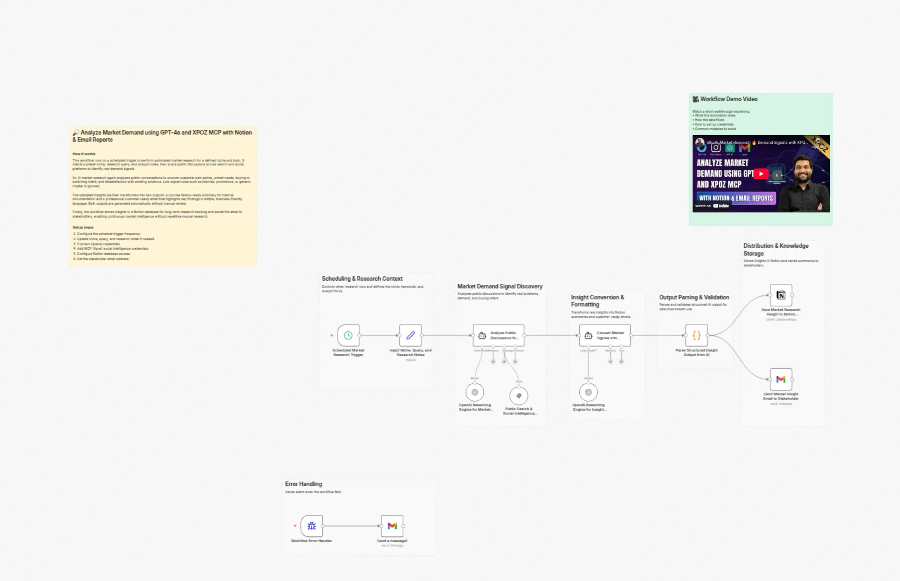

# Analyze market demand using GPT-4o, XPOZ MCP, Notion and email reports

Advanced n8n automation for Analyze market demand using GPT-4o, XPOZ MCP, Notion and email reports.

## Overview
- Category: Market Research, AI RAG
- Complexity: advanced
- Source: n8n workflow template export

## What This Automation Does
Automated niche market research for self-hosted n8n: scans search/social, detects demand signals, and delivers Notion summaries + insight emails.

## Included Files
- `workflow.json`

## Setup
1. Import `workflow.json` into n8n.
2. Configure required credentials for the services used in the workflow nodes.
3. Update any environment variables or static values inside nodes (API keys, URLs, IDs).
4. Run a test execution and then activate the workflow.

## Tech Stack

- `@n8n/n8n-nodes-langchain.agent`
- `@n8n/n8n-nodes-langchain.lmChatOpenAi`
- `@n8n/n8n-nodes-langchain.mcpClientTool`
- `n8n-nodes-base.code`
- `n8n-nodes-base.errorTrigger`
- `n8n-nodes-base.gmail`
- `n8n-nodes-base.notion`
- `n8n-nodes-base.scheduleTrigger`
- `n8n-nodes-base.set`
- `n8n-nodes-base.stickyNote`

## Author

Murtaza Baig

## Screenshots

## License
MIT License. See `LICENSE`.